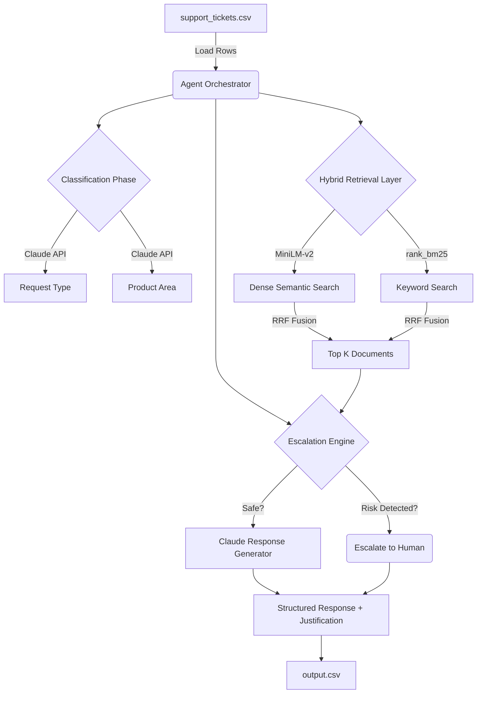

<div align="center">
  

  <h1>🚀 AI Support Triage Agent</h1>
  <p><b>A production-ready RAG agent for intelligent, multi-domain support ticket routing across the HackerRank, Claude, and Visa ecosystems.</b></p>

  <p>
    
    
    
    
  </p>
</div>

---

## ✨ Overview

This terminal-based triage agent automates the resolution of support tickets by combining **semantic search**, **BM25 keyword retrieval**, and **LLM reasoning**. Built for the HackerRank Orchestrate 2026 hackathon, it processes `.csv` ticket dumps and categorizes, answers, or safely escalates them.

### 🌟 Key Features
- **Hybrid Search Architecture**: Reciprocal Rank Fusion (RRF) combining `all-MiniLM-L6-v2` dense vectors and BM25 token matching.
- **Safety-First Routing**: 30+ sophisticated regex triggers instantly detect fraud, legal, security, and GDPR requests to preemptively escalate before LLM interaction.
- **Strict Grounding Policy**: Responses are exclusively built from the local markdown corpus to ensure zero hallucination.
- **Resilient Pipeline**: Graceful per-row fallback mechanism prevents pipeline crashes on malformed requests or API errors.

---

## 🛠️ Architecture Flow



---

## 🚀 Getting Started

### 1. Prerequisites
- Python 3.10 or higher
- An API Key for Anthropic Claude.

### 2. Installation
Clone the repo and install dependencies:
```bash
pip install -r code/requirements.txt
```

### 3. Configuration
Copy the sample environment file and set up your variables:
```bash
cp .env.example .env
# Edit .env and paste your API key:
# ANTHROPIC_API_KEY=your_key_here
```

### 4. Usage

Run the agent over the full ticket corpus:
```bash
python code/main.py
```

**Testing Mode (Dry-Run)** — processes only the first 5 rows:
```bash
python code/main.py --dry-run
```

**Custom Input/Output Files**:
```bash
python code/main.py --input custom_tickets.csv --output custom_results.csv
```

---

## 🏗️ Deep Dive: Module Breakdown

<details>
<summary><b>1. Retrieval <code>(retrieval/...)</code></b></summary>
<ul>
  <li><code>corpus_loader.py</code>: recursively walks <code>data/</code>, parsing Markdown into ~300-token chunks with 50-token overlap, tagged by domain.</li>
  <li><code>embeddings.py</code>: lazy-loads the <code>sentence-transformers</code> MiniLM model to save overhead. Embeddings are L2-normalized upon creation.</li>
  <li><code>retriever.py</code>: builds indices and evaluates queries using Reciprocal Rank Fusion on BM25 and Semantic Hits.</li>
</ul>
</details>

<details>
<summary><b>2. Agent Decision Engine <code>(agent/...)</code></b></summary>
<ul>
  <li><code>classifier.py</code>: maps tickets to a known <code>request_type</code> and extracts the immediate <code>product_area</code> to help steer retrieval context correctly.</li>
  <li><code>escalation.py</code>: scans for high urgency keywords (e.g. "chargeback", "urgent", "delete data") and applies an absolute threshold on retrieval score to prevent blind guessing.</li>
  <li><code>response_generator.py</code>: enforces a strict system prompt restricting the model to only use the <code>&lt;context&gt;</code> tags. Outputs a user-friendly response and an internal justification reasoning trail.</li>
  <li><code>triage_agent.py</code>: ties it all together into a clean, unified function.</li>
</ul>
</details>

---

## 🎨 Design Principles

- **Zero-Guessing Strategy**: Unsure about a ticket? The AI delegates it. This reduces liability in enterprise flows.
- **Fail Gracefully**: Single ticket failures are recorded as `escalated` in output rather than panicking the entire queue.
- **Determinism**: Execution uses `seed=42`, `temperature=0.0` to preserve reproducibility for the judging panel.
